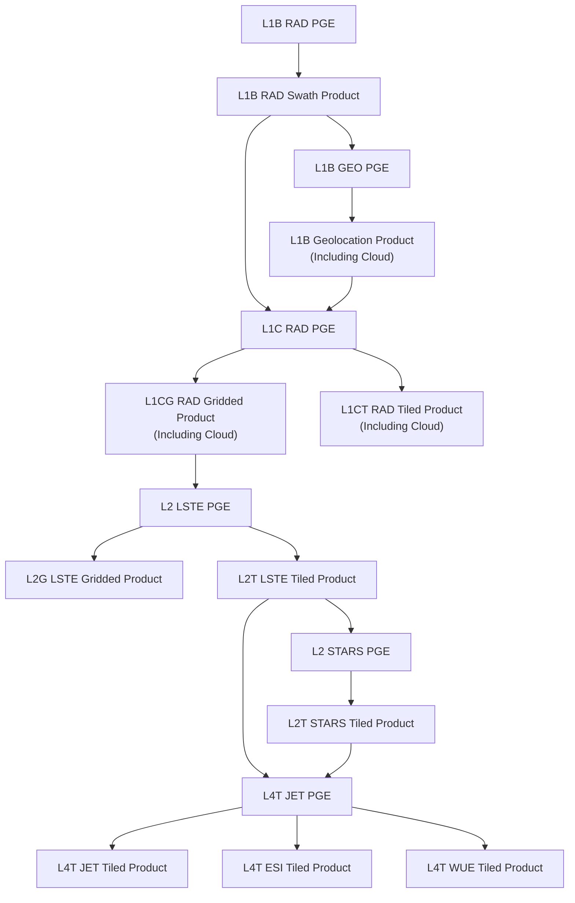

# Surface Biology and Geology (SBG) OTTER Thermal Infrared Data Product Algorithms

This organization contains the data product algorithms for the Surface Biology and Geology Thermal Infrared (SBG-TIR) Orbiting Terrestrial Thermal Emission Radiometer (OTTER) sensor.

## Flow-Chart

## SBG-TIR Data Product Algorithms

The SBG-TIR data product algorithms include:
- [Level 1 Radiance and Brightness Temperature (L1 BT)](https://github.com/sbg-tir/SBG-TIR-L1)
- [Level 2 Land-Surface Temperature and Emissivity (L2 LSTE)](https://github.com/sbg-tir/SBG-TIR-L2-LSTE)
- [Level 2 STARS NDVI and Albedo (L2 STARS)](https://github.com/sbg-tir/SBG-TIR-L2-STARS)
- [Level 3 Evapotranspiration (L3 ET)](https://github.com/sbg-tir/SBG-TIR-L3-ET)
  - [Level 4 Evapotranspiration (L4 ESI)](https://github.com/sbg-tir/SBG-TIR-L3-ET?tab=readme-ov-file#l4t-esi-and-wue-products)
  - [Level 4 Water Use Efficiency (L4 WUE)](https://github.com/sbg-tir/SBG-TIR-L3-ET?tab=readme-ov-file#l4t-esi-and-wue-products)
- [Level 3 Surface Mineralogy (L3 SM)](https://github.com/sbg-tir/SBG-TIR-L3-SM)
- [Level 3 Elevated Temperature Features (L3 ETF)](https://github.com/sbg-tir/SBG-TIR-L3-ETF)
  - [Level 4 Volcanic Activity (L4 VA)](https://github.com/sbg-tir/SBG-TIR-L4-VA)

## Evapotranspiration Models

The evapotranspiration models for the level 3 and 4 ecosystem products are being developed in the [JPL-Evapotranspiration-Algorithms](https://github.com/JPL-Evapotranspiration-Algorithms) organization. These models include:
- [Surface Temperature Initiated Closure (STIC)](https://github.com/JPL-Evapotranspiration-Algorithms/STIC)
- [Breathing Earth System Simulator (BESS)](https://github.com/JPL-Evapotranspiration-Algorithms/BESS)
- [Priestley Taylor Jet Propulsion Laboratory (PT-JPL)](https://github.com/JPL-Evapotranspiration-Algorithms/PT-JPL)
- [Priestley Taylor Jet Propulsion Laboratory Soil Moisture (PT-JPL-SM)](https://github.com/JPL-Evapotranspiration-Algorithms/PT-JPL-SM)

## STARS Data Fusion System

The STARS data fusion system supporting the auxiliary inputs for the ecosystem products is being developed in the [STARS-Data-Fusion](https://github.com/STARS-Data-Fusion) organization.

The Julia implementation for the STARS data fusion algorithm is in [STARS.jl](https://github.com/STARS-Data-Fusion/STARS.jl).

There are several supporting sub-components in generalized Julia packages, including:

- [SentinelTiles.jl](https://github.com/STARS-Data-Fusion/SentinelTiles.jl) for geo-referencing Sentinel UTM tiles
- [MODLAND.jl](https://github.com/STARS-Data-Fusion/MODLAND.jl) for geo-referencing MODIS/VIIRS sinusoidal tiles
- [CMR.jl](https://github.com/STARS-Data-Fusion/CMR.jl) for searching the Common Metadata Repository (CMR)
- [HLS.jl](https://github.com/STARS-Data-Fusion/HLS.jl) for searching and downloading the Harmonized Landsat Sentinel (HLS) dataset
- [VNP43NRT.jl](https://github.com/STARS-Data-Fusion/VNP43NRT.jl) for Bidirectional Reflectance Distribution Function (BRDF)

## SBG-VSWIR

The algorithms for the visible shortwave infrared (VSWIR) component of the SBG mission are in the [sbg-vswir](https://github.com/sbg-vswir) organization.
